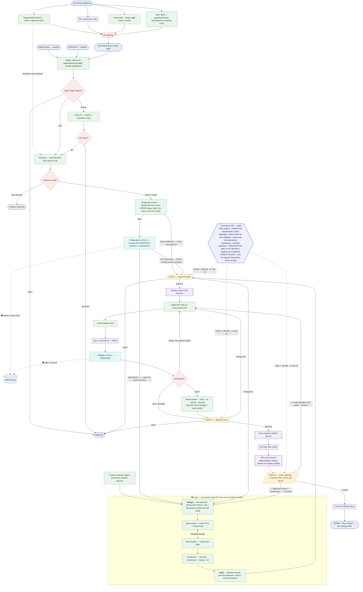
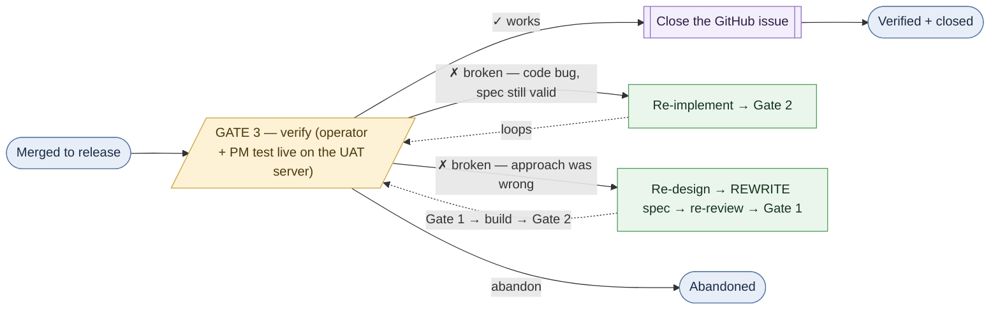

# Evolve — SDLC process flow (v0.8.0)

> **Generated view.** The source of truth is [`sdlc.yaml`](./sdlc.yaml); this
> Mermaid is the picture of it. Open this file in GitHub (or VS Code preview /
> mermaid.live) to see the graph. See [`../EVOLVE.md`](../EVOLVE.md) for the design.

**Legend:** 🟦 event (incl. cadence triggers) · 🟩 agent (one specialized agent
each) · 🟪 system (deterministic automation, no LLM) · 🟨 human gate · 🟥 gateway
(branch/join). Dashed edge = the variance fast-path.

### Reading it

- **Four intake lanes — two reactive, two proactive:**
  - **Reactive:** *GitHub issues* and *PRs* (one connector, no in-app tracker) → **Triage**.
  - **Proactive A — Feature-proposer agent (cadence):** generates new-feature proposals
    from the charter + request clusters + C/F/S coverage gaps → enters the **Lead** spec
    phase (already vision-aligned). (Distinct from the spec-phase **Design** agent inside
    the Lead, which sets the *how* for an accepted item.)
  - **Proactive B — QA / bug-discovery (cadence):** a *separate* system running four
    detectors in parallel — **variance/drift** (code vs. approved spec), the
    **regression suite**, a **code-audit** agent (defects in the *code*), and a
    **spec-audit** agent (gaps/holes/naive assumptions in the *C/F/S* itself) —
    whose findings become **bug or spec-gap** work items → **Triage**.
- **Variance fast-path** (dashed): a *pure* code-vs-approved-spec drift skips
  Spec-author **and** Gate 1 (the intent was approved when the spec was) → straight
  to **Prioritize**, then implement → validate → Gate 2.
- **The funnel — cheap gates BEFORE the expensive spec phase (so it scales).** After
  Triage rejects junk (duplicate / malicious / invalid), **Vision-fit** judges scope (the
  **platform charter + the target Capability's scope**; help.md/guide.md are inputs, not the
  authority) — *features only*, since a bug fixes already-accepted behavior. Then **Prioritize**
  is the attention valve: the long tail is *parked/declined* (recorded), only **top-N or
  safety-critical** reach the Lead. The expensive Design/spec/build runs ONLY for the
  survivors — the difference between a trickle and a public repo's thousands of issues.
  (Prioritize scoring on *fed* demand signals — GitHub reactions + duplicate-cluster counts,
  not the agent's guess — is the next per-agent refinement.)
- **Gate-1 now OPENS with a security screen + empirical reproduction — BEFORE any code is read.**
  Reading code alone misattributes a UI symptom to the wrong code (a "chat bubble" is the same
  on-screen element whether it came from the agent loop or the background notifier — #41 was the
  *notifier* path, but the code-read found `react-markdown` in the chat bubble and wrongly concluded
  "no issue"). So for a surfaced item, the spec phase opens with two new agents:
  1. **Security screen** (`security-screen`) — a subagent that reads **only the raw issue** and
     classifies its **intent**. A good-faith fix/feature is `clear`; an issue whose *reproduction
     itself* would be an attack ("prove you can break into X / leak Y") is **blocked** → it never
     reaches the reproduce step (the repro agent must never become the weapon) and is flagged at
     Gate 1.
  2. **Reproduce on box 2** (`reproduce`) — deploy the current `release` (pre-fix) and recreate the
     **reported** symptom on its exact user-facing surface, **screenshot what the user sees**, and
     post it to the GitHub issue. *Could-not-reproduce is a first-class outcome* — a "couldn't
     reproduce" Gate-1 finding (already fixed? steps unclear? environment-specific?), never an
     invented fix. A **reproduced** item carries its proven `surface` into Grounding, which then
     anchors on the code behind THAT surface — not the one the wording merely implies.
- **Screenshot proofs bracket the change, on the GitHub issue itself** (via `github_connector.attach_image_to_issue`
  → a catbox inline image, which renders even on a private repo): the **before / repro** shot at
  Gate 1 (here's the bug, this is what the user sees) and the **after / fix** shot at
  validation → Gate 2 / Gate 3 (here's it fixed, same surface). The operator judges the actual
  rendered pixels, not the agents' code reasoning.
- **The Lead owns the spec phase** (an agentic inner loop inside the deterministic
  walk). It runs **Design** (how should it work — reframes the ask, sets the approach,
  honors the engineering principles), then iterates **Spec-author ⇄ Spec-auditor** in
  **bounded** rounds (a stuck negotiation *escalates* to the human rather than spinning),
  brings in **Security / Architecture / Interop / UX**, **arbitrates**, and is the single
  agent that hands the human a synthesized **proposal + recommendation** at Gate 1. Every
  agent (the Lead included) emits a plain-language `summary` and gets its own UI panel.
- **Gate 1** (approve intent) → autonomous **implement + author tests** on the box-1
  branch → **box 2** validates with Playwright → loop **failing→retry** / **stuck→
  escalate** / **green→packet** → **Gate 2** → **auto-merge to the `release` branch**
  → **re-sync**. Both gates can **bounce back** ("change this").
- **Every gate has a human-in-the-loop *and their PM*.** A gate is not the operator alone
  clicking approve/change/reject — between the swarm's packet and the decision sits the **operator's
  PM** (a Claude instance on the operator's machine). It **reads each packet**, restates the
  *real* decision in plain language (not the terse button labels), **flags what the packet underplays**
  (thin or un-reproduced validation, a placement/dependency risk, a cross-item conflict), **answers the
  operator's questions** grounded in the live code, and **pushes the agents back** when a conclusion was
  read from code instead of reproduced, or when evidence is missing. Crucially it **operates the gate
  FOR the operator** (`evolve_decide approve|change|reject`) — but **only on the operator's explicit,
  per-item say-so**, using a parent decide-token that lives **only on the operator's machine**: the
  autonomous swarm holds only the service token and **cannot decide its own gates**. It also runs a
  **watcher loop** that catches each gate as it appears and keeps items moving — auto-reviewing, pushing
  back, or approving on the operator's standing instruction, and surfacing genuine forks. (`/chat-ev <n>`
  is the gate-1 requirements-partner form of this role; `/evolve-pm` rebuilds it in a fresh
  session.)
- **Gate 3 — verify (acceptance): merge is NOT done.** Auto-merge ships a *candidate* to `release`;
  "shipped" ≠ "works." So the canonical `/loop` flow continues *past* merge into a **`verify`** phase
  (now shown in the main graph above): `release` is deployed to a **separate UAT server that tracks
  `origin/release`**, the **operator + their PM test it live**, and only then — `✓ works`
  **closes the GitHub issue** (per-change done), or `✗ broken` resumes the SAME conversation: a
  localized **code bug** → re-implement → Gate 2; a **wrong approach** → re-design → rewrite spec →
  re-review → Gate 1. See [§ Gate 3 below](#gate-3--verify-acceptance-loop) for the close-up. (The UAT
  server runs mock data and is separate from any production deployment, so verifying never disturbs a
  live instance.)
- **The build half fails closed (#29).** A change reaches a *green* Gate 2 only when the
  implement agent actually changed code **and** included a runnable **bound test**, and
  box 2 ran *that* test (not the engine's own suite) and it passed. A failed/empty/untested
  implement, or red bound tests, never green — it lands at Gate 2 with a `change`
  recommendation that names the reason, so a broken build can't be auto-approved.
- **The per-change process ends at `release`, not `main`.** Promotion `release →
  main` (publish to the world) is a separate, operator-owned **release gate** —
  batched over many completed instances and verified on the UAT server — so it lives outside
  this per-change graph (EVOLVE.md §5/§9).
- **Where the branches live (Option A — build on box 1):**
  - The **implement agent builds on box 1**, in an isolated worktree on a `feature/*`
    branch cut from box 1's `release`. **box 2** is the disposable test target: it *pulls*
    the feature branch from box 1 (box 2's git origin **is** box 1) and runs the bound
    tests — it never builds or merges.
  - On Gate-2 approve, box 1 merges `feature → release` (local) and **pushes
    `origin/release`** — the staging branch.
  - A **separate UAT server tracks `origin/release`**: `skipper update` (a plain `git pull`) deploys
    the candidate so the operator + PM verify *exactly what will ship*.
  - The operator then merges **`release → main`** (the publish gate; `main` is
    branch-protected). `main` is the world — nothing reaches it except that deliberate
    merge, so box 1 / the agents can never touch production directly.

### Gate 3 — verify (acceptance loop)

**Merge is not done.** Auto-merge ships a *candidate* to `release`, but "shipped" ≠ "works." So
after merge an item enters a **`verify`** phase: `release` is deployed to a **separate UAT server that
tracks `origin/release`** (a dedicated mock-data box, `skipper update`), the **operator and their
PM test it live** (the PM operates the gate on the operator's explicit say-so), and only
then confirm.

- **✗ still broken** feeds the operator's failure note back into the **same 1-issue conversation**
  (no re-grounding — it resumes from the item's saved artifacts), and the agents **judge the depth of
  the fix**:
  - **Localized bug** (approach + spec still right, the code was wrong) → re-implement, update the
    spec's behavior/tests if anything shifted, re-validate, re-push **Gate 2**. The cheap path.
  - **The approach itself was wrong** (the agents change the plan) → **re-enter the spec phase**:
    Design re-frames, the spec is **rewritten** to the new way, spec-audit + the four reviewers
    (security/architecture/interop/ux) re-review the *new* design, and it re-pushes **Gate 1** for
    re-approval before building. A new approach is a new plan — it gets the full funnel, not a code
    patch.
  - **Invariant:** the spec always describes **what is actually built** — a change of approach
    rewrites the spec; you never leave it documenting a way you no longer ship (the architecture
    reviewer flags a stale spec).
- **✓ works** closes the GitHub issue — **the issue stays OPEN until verified**, so a closed issue
  means a human confirmed the fix, not merely that code merged. This is "closing the loop."
- **abandon** drops it without closing the issue as resolved.
- **Where it runs:** live today in the subscription `/loop` engine (`.claude/skills/evolve`, phase
  `gate2 → verify → done`; the UI relabels the gate buttons to ✓Works / Still-broken / Abandon, and
  `github_connector.close_issue` does the close-on-verify). The production SDK graph (`sdlc.yaml`)
  adopts it as a follow-up — it would need a verify-packet builder, the `closeit` system handler, and
  the works/broken/abandon → resume wiring before the node can go live there.
