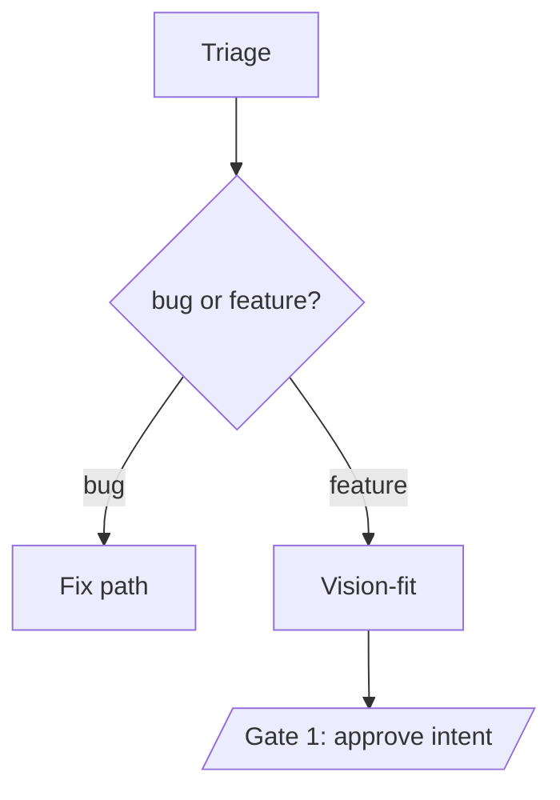

# Evolve — Self-Maintaining Skipper (Design)

> **Status:** Design / brainstorm capture (2026-06-13). Not yet built. This
> document captures the full vision and architecture so any new conversation can
> pick up with the same context. The next concrete artifact after this doc is the
> first **Capability/Feature/Specification (C/F/S)** tree — and the first one we
> write describes Evolve itself.

---

## 1. Vision

Skipper is going public. One person maintains it. The moment it's out, we could
get hundreds or thousands of bug reports and feature requests. **Evolve is how one
maintainer + a community + an agent swarm keep pace** — and how a self-hoster can
extend *their own* Skipper without waiting on anyone.

The reframe that drives every decision below: Evolve is **not "an app that writes
code."** It is a **self-scaling maintainer**. Evolve does the implementation
legwork; the human stays the *judgment* layer. So the design target is to **scale
the gate (what gets approved to reach `main`), not the labor (who writes the
code).** Every mechanism here exists to protect the maintainer's attention and to
make the human's remaining job a fast, high-signal *review* rather than hands-on
coding or testing.

Today's manual workflow we're automating: write a spec in coordination with Claude
Code (or mention an issue ad hoc) → Claude implements + self-checks → **the human
does the UI testing and validation.** Evolve keeps the human as the approver but
automates the build *and* the validation.

---

## 2. Core concept — desired-state reconciliation for features

The organizing structure is **Capability / Feature / Specification (C/F/S)** — a
three-level hierarchy of **software requirements**, stored as records (with state,
notes, links). It deliberately replaces the "Goals/Projects/Tasks" framing (which
is execution-oriented) because C/F/S is about **capturing requirements**, and it
replaces the 2,000-line `OPEN_SOURCE.md` style doc with a queryable, hierarchical
collection.

- **Capability** = a whole app/area (e.g. the Recipes app).
- **Feature** = a screen or sub-area (e.g. the recipe-detail screen).
- **Specification** = one atomic behavior: a single button click, a field layout,
  an edit/update/delete/insert option, a validation rule. Granular on purpose.

**The key idea: C/F/S is NOT a changelog — it is the living, queryable description
of how the software is supposed to behave *right now*.** It is updated, living
documentation of the program's intended state.

This makes it **desired-state reconciliation** (the Terraform/Kubernetes pattern —
declare the world, a controller converges reality to it) applied to application
features:

- Adding/updating a C/F/S record creates a **variance** between the declared
  intended-state and the actual code.
- **Evolve's job is to detect that variance and converge the code to match the
  spec.**

One artifact thereby becomes **four things at once**: requirements, living docs,
the work queue, and the regression-test source. That unification is the win. You
can "regression test all of Recipes" because the specs *are* the source of truth
for how Recipes should behave.

---

## 3. Spec↔test binding (what makes "variance" concrete)

A natural-language spec ("the Save button validates the title and shows an inline
error when empty") is fuzzy as English but **exact as a test**. So **every
Specification binds to its acceptance test(s)**, of two kinds:

- **Deterministic tests** — Playwright UI assertions, unit tests, API assertions.
  Cheap, reliable. The backbone. Run on **every** regression.
- **Agentic tests** — when validation needs judgment ("the error copy is clear,"
  "the layout isn't cramped," "the data looks reasonable"). Use **sparingly**:
  they're flaky and cost tokens. Mitigations: (a) give them a **structured rubric**
  to score against rather than open-ended "looks good?"; (b) run them only on
  *changed* specs plus a periodic full sweep — never fire thousands of agentic
  tests on every regression.

This makes variance **mechanical**: a spec is satisfied iff its tests are green
(on box 2 — see §5). Failing tests, a spec with no test yet, or a freshly-edited
spec whose test must change → that's the variance signal. No agent has to "judge
conformance" in the general case.

Regression = run every test under a Capability/Feature.

---

## 4. Storage — files are truth, the DB is a projection

C/F/S records are **version-controlled YAML files in the repo**, *projected into a
DB* for the Evolve app's operational use. **One rule keeps it from rotting: files
are the source of truth; the DB is a projection. Never co-equal writers.** (Same
pattern as platform migrations: files are truth, a DB table is the queryable
index.)

Sync model:

- **Boot: files → DB.** On startup the brain scans `specs/**/*.yaml`, checksums
  each, and upserts into the DB (mirrors how the platform migration runner tracks
  `migrations/*` in `public.platform_migrations`). The DB now mirrors committed
  truth and is queryable for the Evolve UI.
- **Edits: DB → files, on the same branch as the code.** When an agent (or the
  human) changes a spec, it writes the DB record *and serializes it back to its
  YAML file* in the box-1 workspace checkout, then commits it **in the same
  feature branch as the code + tests that satisfy it.** A spec change, its
  implementation, and its acceptance tests therefore **merge as one atomic unit** —
  the diff always carries intent + code + tests together, and `main` is never
  code-without-spec or spec-without-code.
- **After merge: re-sync.** The brain pulls `main`, re-runs files→DB; the DB ==
  merged truth again.

Mental model: **the DB is a working/staging layer over the file-committed
baseline.** In-flight *proposals* and *variances* live in the DB
(status: proposed/implementing); the committed YAML on `main` is the "HEAD" desired
state; a merge promotes a proposal into the files. You get a git-like staging area
for *requirements* — and history/diff/blame come **free** because the specs live in
the repo (`git log specs/recipes/` = "how Recipes' behavior changed over time").

### Example spec file

```yaml
# specs/recipes/recipe-detail/edit-button.yaml
id: spec-recipes-recipe-detail-edit-button
capability: recipes
feature: recipe-detail
state: live            # proposed → approved → implementing → in-review → live → deprecated
behavior: >
  Recipe detail shows an Edit button; clicking opens the edit form prefilled
  with current values; Save validates a non-empty title.
implements: [apps/recipes/ui/RecipeDetail.jsx, apps/recipes/routes.py]
tests:
  - { type: playwright, path: tests/recipes/recipe-detail/edit-button.spec.ts }
  - { type: agentic, rubric: "Edit form prefilled and visually matches the create form" }
notes: "..."
links: { issue: ISS-123, pr: PR-45 }
```

---

## 5. The dev/test environment — two boxes, never the Pi

Production runs on the Raspberry Pi (`skipper-pi`) and **is never touched by
Evolve.** A new Linux VM on the VMware ESXi server hosts the dev/Evolve
environment — a controlled, throwaway sandbox where we can run
`--dangerously-skip-permissions` + trust-all-dirs and even restrict network. The
key reframe: since the VM is disposable, **the safety question isn't "protect the
dev box," it's "gate what reaches `main`."**

Three separate roles, so no instance ever mutates the code it's running on:

- **Box 1 — the Evolution brain.** Skipper runs here (e.g. at
  `/home/rodney/skipperbot-platform`) — the stable brain, the Evolve thinking
  domain + the agent swarm. A **separate workspace checkout** at
  `/home/rodney/repos/skipperbot-platform` is where the Agent SDK makes code
  changes on a **feature branch** and commits. The brain never edits its own
  running code.
- **Box 2 — a disposable full instance.** Checks out + runs the feature branch,
  with its own database and full install. This is the live system under test.
  Box 1 has full control of it (ssh / shutdown / direct DB queries) and **full
  autonomy over it for validation.**
- **Validation channel:** prefer a **headless browser + Playwright MCP on box 1
  pointed at box 2's URL** over full computer-use. Playwright is deterministic
  (real selectors, DOM assertions, network waits), far less flaky than
  pixel-clicking, and emits structured pass/fail + screenshots the agent and the
  human can read. Computer-use is the fallback for anything outside the browser.

Consequence worth naming: with box 2 + Playwright, **Evolve can self-validate the
UI** — so the human moves from "hands-on tester of every change" to "reviewer of
the diff + the agent's test report/screenshots." That's the much smaller gate.

Mechanics to pin down later: the git path box1→box2 (push branch via GitHub vs.
box 1 as a local git remote for box 2); resetting box 2's DB to a known seed
between runs for reproducibility; and a known test user / service token so
Playwright can get through box 2's auth gate.

---

## 6. The agent architecture

Built on the **Claude Agent SDK** (the right tool — designed for long-running,
programmatic, autonomous agents on top of Claude Code, with permission/hook
control and structured results). Headless Claude (`claude -p`) works for a v1, but
the SDK is the robust embedding path.

Following the **Hermes Agent** pattern: **multiple specialized "agents," each a
well-curated prompt document with a single focused job** — analogous to today's PM
thinking domain (focused on good project-management practice). Each has tooling to
drive the Agent SDK.

### The complete agent roster

The full decomposition, by pipeline stage. **Each is a separate agent from day
one** — single responsibility, its own curated prompt + typed I/O. We deliberately
do **not** merge them at the start: a kitchen-sink agent does too many things (and
fails opaquely — you can't tell which responsibility broke), and once merged the
boundaries are hard to recover. Start each agent with **basic** prompting that does
its one job; deepen the prompt only where you see it fail. The framework below
(§ "Agent framework") is what makes running this many small agents — and adding
more — cheap. Think in **small, decomposable pieces of agentic functionality.**

**Intake & triage**
- **Triage agent** — classify an incoming issue (bug vs. feature request), dedup
  against open items, and link it to the C/F/S it touches. (Applied to PRs too, to
  read the contribution's *intent*.)
- **Vision-fit agent** — judge whether a feature request fits the **charter**;
  reject/park off-vision asks before they consume the pipeline.
- **Design (product-visionary) agent** — the *proactive* intake lane: propose new
  Capabilities/Features grounded in the charter, request clusters, and C/F/S
  coverage gaps ("what would a family need?").
- **Spec-authoring agent** — turn accepted intent (issue / PR / design idea) into
  structured **C/F/S records**: the behavior statement + the bound acceptance
  tests. (The "draft the requirement" function.)

**Review & consistency**
- **Security agent** — scan changes (especially incoming PRs) for vulnerabilities,
  malicious code, and supply-chain risk.
- **Architecture agent** — system fit: app interactions, platform↔app boundaries,
  downstream impacts, the one-directional dependency rule.
- **Interoperability / consistency agent** — spec-vs-spec conflict detection — "is
  the desired state *satisfiable*?" (detailed below).
- **UX/UI agent** — good UX/UI design and consistency across apps.

**Prioritization**
- **Prioritization (backlog-PM) agent** — score every proposal across all lanes
  onto **one ranked queue**; surface the top-N; park/auto-decline the long tail
  (never safety-critical); learn the maintainer's taste over time.

**Implementation & validation**
- **Implementation (coding) agent** — write the code that converges the codebase to
  the approved spec, on the box-1 workspace feature branch.
- **Test-authoring agent** — write/update the spec's bound acceptance tests
  (deterministic Playwright/unit + agentic rubrics).
- **Validation agent** — run the tests on **box 2** (Playwright against box 2's
  URL), judge the agentic rubrics, capture pass/fail + screenshots, and drive the
  fix→retest loop (to green or to escalation).

**Reconciliation & housekeeping**
- **Spec-extraction (reverse-engineering) agent** — read existing code → draft/
  refresh baseline C/F/S. This is the **bootstrap** engine (avoids hand-writing
  thousands of specs) *and* how a directly-merged PR gets re-baselined into specs.
- **Variance / drift detector** — find specs whose tests fail or whose code has
  drifted from the spec; queue reconciliation. (Mostly **mechanical** — tests +
  checksums — with an agentic fallback.)
- **Review-packet agent** — assemble the pre-digested **Gate-2 packet** (diff +
  spec change + test results + screenshots + plain-language summary). (Lightweight;
  may just be the orchestrator.)

**Orchestration**
- **Evolve-core orchestrator** — the Evolve thinking domain itself: the conductor
  that routes items through the pipeline, manages C/F/S **state transitions**,
  spawns the specialists above, and enforces **budgets, the two gates, and the
  Evolve-core hands-on guardrail**.

**On the interoperability agent specifically:** a desired-state system is only
reconcilable if the desired state is *internally consistent* — if two specs
contradict, no code satisfies both and Evolve thrashes forever. It is the natural
complement to the test binding: **tests catch "code doesn't match a spec"; interop
catches "two specs can't both be true,"** at the requirements level *before* any
implementation (the cheapest place). Two layers, like tests: **structural/mechanical**
conflicts are deterministic and can hard-block (two specs claiming the same route /
entity prefix / `implements` line with contradictory behavior, duplicate IDs);
**semantic/behavioral** conflicts are agentic and get *flagged* for resolution, not
auto-blocked (false-positive risk). Run it **at proposal time** (check a proposal
against the corpus before Gate 1 → "this contradicts spec X, resolve first") **and
on a periodic full-corpus sweep** (catch drift). **Scope by locality, not N²** —
bound the search to same Capability/Feature, specs sharing `implements` files,
shared entity types/routes, and declared cross-app links; the platform's
one-directional dependency rule (apps→platform, never app→app) shrinks the surface.
This also sharpens the architecture agent's boundary: arch = "does this fit the
system / downstream impacts"; interop = "do the specs logically coexist."

### Agent framework — small pieces, BPM-orchestrated, scales to any N

**Principle: one agent = one responsibility = one curated prompt + typed I/O.**
Never merge responsibilities at the start — a kitchen-sink agent does too many
things and fails opaquely, and once merged the boundaries are hard to recover.
Start each agent with *basic* prompting that does its one job; **deepen the prompt
only where you see it fail, never by combining jobs.** Think in **small,
decomposable pieces of agentic functionality.** The system must scale to *any*
number of agents and sub-agents, so the real deliverable is the **substrate**, not
the agents.

**Model the whole thing as a BPM (business-process-management) flow for the SDLC.**
Each node is an agent or a human; the orchestrator is a **process engine that walks
an editable flow definition** — not hardcoded code. BPM maps almost 1:1:

- **Service task = agent** (single responsibility).
- **User task = a gate.** Gate 1 / Gate 2 are human-approval steps — human-in-the-
  loop is native, not special-cased.
- **Gateways = branches:** bug-vs-feature after triage, conflict→resolve, tests-
  fail→loop, stuck→escalate.
- **Parallel gateway = the review fan-out:** security + architecture + interop + UX
  run concurrently, then join.
- **Sub-process = sub-agents:** a node (e.g. "Implement") expands into its own flow —
  recursion to any depth.
- **Process instance = a work item's state:** each issue/PR/proposal flows through
  the graph; "where is it" *is* the C/F/S/proposal record's state. The engine
  tracks every item's position → process-level observability, time-at-step,
  bottlenecks, audit, for free.
- **The process definition is data — versioned, editable** — so the SDLC is an
  artifact you change without touching the engine, and (recursively) Evolve can
  edit its own process as a C/F/S change.
- **Pragmatic:** borrow BPMN's *concepts* (typed tasks, gateways, events,
  service/user tasks), not necessarily a heavyweight engine — a lightweight
  graph-walker suffices.

What the substrate must provide so the Nth agent drops in trivially:

- **A uniform agent contract.** Every agent declares: a curated prompt doc, a typed
  input schema, a typed output schema, an allowed-tool set, and config (model tier,
  token budget, autonomy level). This is the **app-package philosophy applied to
  agents** — manifest + standard structure + auto-registration.
- **A registry + loader.** Agents auto-register from definition files, exactly like
  apps / tools / job-handlers do today. Adding one is dropping in a file, not
  editing the orchestrator.
- **A typed blackboard, not prose telephone.** Agents hand off via structured
  artifacts (proposal record, C/F/S record, test report) — reading/writing typed
  fields, never free-text summaries passed agent-to-agent. The DB-projected C/F/S
  *is* the shared working state; this is what keeps a long agent chain from
  degrading into a game of telephone.
- **Per-agent everything** — model, tools, budget, autonomy, prompt — in the
  agent's own definition (cheap classifier → small model; architecture agent →
  smart model).
- **Observability + versioned prompts.** Every invocation logged
  (input/output/cost/decision) so you can see which agent did what; each prompt doc
  is a versioned file in the repo. Recursively, the agent definitions are
  themselves C/F/S-managed — Evolve improves its own agents.

### Process file format + visualization (DECIDED — own the model + Mermaid)

We **own the model and build our own process-flow code**; we do **not** bundle a
third-party BPM application into the repo. Three pieces:

- **Canonical format: our own minimal JSON/YAML process model** — the source of
  truth the engine executes and Evolve edits. `nodes` (`type: agent | gate |
  gateway`, with the agent ref / condition / lane), `edges` (`from`, `to`, `when`),
  lanes. Small, diffable, agent-editable. **BPMN-XML is *not* canonical** (verbose,
  ugly to diff, heavy for agents) — at most an optional one-way export if we ever
  want to open it in a BPMN tool.
- **Engine: ours.** A lightweight graph-walker over that model — total control,
  zero runtime dependency, no heavyweight BPM engine bundled. ("Build it ourselves,
  which may be better" — here it genuinely is.)
- **Visualization now: generate Mermaid from the model.** Mermaid is text, so the
  diagram lives in the repo and renders for free in **GitHub, VS Code preview, and
  mermaid.live — nothing installed, nothing embedded.** One-way: model → generated
  `.mmd`/markdown view, openable in another program without baking that program into
  the build.
- **Visualization later (in-app drag-edit): react-flow or mermaid.js** — an MIT
  *library* (a normal dependency, like the platform's leaflet / react-markdown —
  **not** a bundled application) — for editing the flow inside Skipper's own UI,
  round-tripping to the model. Deferred; the Mermaid-from-model path covers
  authoring until then.

Data flow: **JSON/YAML model = truth → tiny generator emits Mermaid → view/diff
anywhere.** Example:

```yaml
# evolve/process/sdlc.yaml  (the truth)
nodes:
  - { id: triage,    type: agent,   agent: triage }
  - { id: kind,      type: gateway, kind: exclusive }     # bug or feature?
  - { id: visionfit, type: agent,   agent: vision-fit }
  - { id: gate1,     type: gate,    label: "Approve intent" }
edges:
  - { from: triage,    to: kind }
  - { from: kind,      to: fix,       when: bug }
  - { from: kind,      to: visionfit, when: feature }
  - { from: visionfit, to: gate1 }
```


These are separate functions needing very specific prompt guidance. (The agent
swarm itself is later C/F/S that a thin Evolve helps build — see §10.)

How Python/tools actually run: Claude doesn't "call functions" natively — it runs
scripts via the Bash/Agent-SDK tools. So the pattern is **commands as the human
entry points, skills as reusable capability bundles, Python as the deterministic
muscle the model drives.** Push the parts that must be exact into Python (create a
worktree, apply a patch, run the suite, parse results, open a PR); leave judgment
to the model.

### Skills/commands shipping with the repo

Project `.claude/commands/<name>.md` (slash-invocable as `/name`) and
`.claude/skills/<name>/SKILL.md` (model-invocable, can bundle scripts) **travel
with a clone** — anyone who starts Claude Code in the repo gets them (subject to
the directory-trust prompt). So a self-hoster's own Claude Code can drive the same
Evolve workflow. (Note: shipping hooks/MCP in `.claude/` is executable config and
a supply-chain consideration for a public repo; plain command/skill markdown is
low-risk.)

---

## 7. Intake — per-instance, with a canonical authority

**Model: per-instance C/F/S.** Skipper is meant to be **hackable**. If someone
wants their Skipper to do something weird/custom, that's *not* a spec they'd share.
So the Evolve machinery is available to **anyone to expand their own Skipper**
(or they ignore it and use Claude directly). C/F/S is inherently **per-fork** — it
describes how *that* codebase behaves; one shared C/F/S across all self-hosters
would be incoherent.

**The operator (maintainer) keeps the canonical master C/F/S in their copy** — the
source of truth for the public release. This is the **OSS-maintainer model,
automated**: forks do their own thing; community contributions are judged against
the maintainer's canonical specs.

### Intake sources & triage

Three intake **sources**, but **one pipeline and one gate** — they all converge on
the same artifact (proposed C/F/S changes) and the same Gate 1. Sources plural,
pipeline singular.

1. **Reactive — requests (issues).** An agent uses the existing C/F/S (= current
   known/desirable state) to decide: is this a *bug* we should fix, or actually a
   *new feature request*? If a feature, a **vision-fit agent** decides whether it
   fits Skipper's vision (see the charter, §9) — with **guardrails for how far it
   can go without human intervention.** (Example: "after entering an auto issue you
   can't edit it — there should be an Edit button" → agent agrees, good UX →
   proposes a spec.)
2. **Reactive — contributions (PRs).** Treat an incoming PR as a **high-signal
   feature request that happens to ship a reference implementation — not code to
   merge verbatim.** Security/arch agents evaluate intent + blast radius against
   the canonical C/F/S; if good, it becomes a **spec change**, and Evolve
   implements it *canonically* (reusing the PR's clean parts, rewriting the rest),
   validates, and lands a commit on top of — or in place of — the PR, with the
   C/F/S now complete. A sloppy PR with a great idea still helps; code quality and
   the single source of truth are protected.
3. **Proactive — design/vision (design agents).** Intake isn't only reactive.
   **Design agents** look at the current C/F/S + the charter (home/family OS) and
   propose **what *should* exist that nobody asked for** — "what would a family
   need?" They emit Capabilities, Features, *or* Specifications (they can deepen
   existing capabilities, not just propose new apps — "this flow has no undo,"
   "Recipes has no meal-plan view"). Just another Hermes-style specialist (a
   "product visionary for a family OS") on a cadence, like the PM domain, feeding
   the same proposal queue — no new machinery.
   - **Charter does double duty:** it's both the *filter* for reactive intake and
     the *generative seed* for this lane.
   - **Ground it in signal, not free-association:** strongest when it **synthesizes
     the actual request stream** (clusters of similar asks → a latent capability),
     finds **C/F/S coverage gaps**, and looks at usage — not when it invents from a
     blank page.
   - **Guardrail (important):** this lane is the most likely to violate "protect
     the maintainer's attention." A generative agent can produce infinite
     "wouldn't it be cool if…" and flood Gate 1. So it must be **high-bar and
     selective** — a periodic *design review* surfacing a small curated set with
     explicit reasoning (what need, why it fits), not a firehose. Net-new
     *direction* is exactly where human judgment matters most, so proactive
     proposals stay **lower-autonomy / always hard-gated** (a bug fix can run more
     autonomously; "add a family-finance app" never should). The design agent may
     *propose* charter changes, but **the human owns the vision** — it never
     silently expands what Skipper is.

### Prioritization — turning the flood into a ranked queue

Prioritization is the half that makes "scale the gate" actually work. A good gate
judges the *quality* of one item; **prioritization decides which items reach the
human at all, and in what order.** Without it, even a perfect gate is swamped by
volume (the design lane especially). So a dedicated **backlog-PM agent** scores
every proposed C/F/S change.

- **One ranked queue across all three lanes.** A critical security PR, a
  broken-code-path bug, a high-demand feature, and a design "what if" all compete
  for the same scarce resource — the human's attention — so they're scored on **one
  scale** and surfaced as **one priority-ordered list.** ("Three sources → one
  pipeline → one gate" becomes "→ one *ranked* queue.")
- **Scoring** ≈ criticality + reach + demand + vision-fit, weighed against
  effort/risk:
  - **Criticality pre-empts** — a security vuln or broken/data-losing code path
    jumps the queue (possibly an expedited track with a tighter gate), not waiting
    behind feature ideas.
  - **Reach/demand** — for the canonical repo, how many users affected / how many
    asked (the request clusters the design lane surfaces).
  - **Effort/risk** — a small safe fix outranks a big risky rewrite of equal value.
- **It must *cut*, not just *order*.** Ordering alone still grows the backlog
  forever. The prioritizer surfaces the **top-N to the human** and **parks or
  auto-declines the long tail with a recorded reason** — nothing is lost (it can be
  fished back out), but it never costs attention. **Floor: safety-critical items
  are never auto-cut** — always surfaced (a misjudged auto-decline of a real vuln
  is the failure mode to avoid).
- **It learns the maintainer's taste.** Every reorder/rejection is signal; over
  time it converges on *what the human would have prioritized*, making the gate
  cheaper the longer it runs — the same self-hosting compounding as everywhere
  else.

Precedent to reuse, not reinvent: the **PM thinking domain** already scores
projects by staleness/risk, and the **Prioritize app** is a backlog aggregator
(`register_backlog_provider` + focus slots). The C/F/S proposal queue can plug into
that machinery.

### The Issues app

Keep it for the family, but **make the boundary unmissable in the UI**: the in-app
Issues app = **"improve *my* Skipper"** (feeds *this instance's* Evolve). "Report a
bug to the Skipper *project*" is a separate action that goes to the project's
GitHub. If those blur, the maintainer drowns — and a family member may think they
filed with the project when they only filed locally. On the canonical instance,
the GitHub issues are where the project's intake syncs in.

---

## 8. The approval flow — two gates, then auto-merge

Two human gates, both *review* (not labor):

1. **Gate 1 — approve the intent/spec.** After agents evaluate an issue/PR, judge
   fit, and propose C/F/S changes, it hits the human. "Go," or "change this/that"
   (the agent revises). Gate on **intent**, not code.
2. *(autonomous)* **Run to the races** — serialize the spec to file, implement the
   code, write/adjust the tests, on a feature branch; box 2 builds and validates;
   the implementation agent **loops fix→retest up to a budget.**
3. **Gate 2 — approve the result.** The human gets a **pre-digested review
   packet** — the diff, the spec change, the test results (pass/fail + Playwright
   screenshots), and the agent's summary of what it did and why. The packet's
   quality is what makes this a 30-second gate. Gate 2 has **two arrivals**:
   "here's a passing change, approve?" and "I couldn't converge, here's where I'm
   stuck." Like Gate 1, it can bounce back ("change this"), not just
   approve/reject.
4. On approval → **automatically push/merge the feature branch to `main`**
   (carrying spec + code + tests as one atomic unit). Cycle done; brain re-syncs.

Budget/iteration bounds: hard caps per task (token budget, max fix-test cycles)
and an explicit **give-up-and-escalate** path so autonomous loops can't thrash.

### Full cycle, end to end

```
issue / PR / proactive design proposal          (three intake sources)
  → triage + vision-fit + security/arch + interop conflict-check + author spec change
  → prioritize (backlog PM): rank across all lanes → top-N reach the human
  → GATE 1 (human approves intent)
  → serialize spec → file  +  implement code  +  write/adjust tests   (feature branch, box-1 workspace)
  → box 2 pulls/restarts → run the spec's tests (loop-to-green or escalate)
  → GATE 2 (human approves the review packet)
  → auto-merge spec + code + tests → main
  → brain re-syncs (files → DB)
```

Every box is either deterministic machinery or a fast human review — never the
human reading raw code.

---

## 9. Charter (vision-fit) + guardrails

The "does this fit Skipper's vision" agent needs a curated **charter** — a
*"what Skipper is and isn't"* document — to judge requests against. It's one of the
Hermes-style prompt docs and **the thing that lets the maintainer say *no* at scale
without weighing every request by hand.** It also encodes the autonomy guardrails
(how far Evolve can go unattended) and the **Evolve-core asymmetry** below.

**The one genuinely dangerous self-mod: Evolve modifying Evolve-core.** A bad *app*
change breaks an app; a bad change to *Evolve-core* can brick the brain's ability
to make any further change. So:

- App changes can run more autonomously; **Evolve-core changes stay hands-on**,
  with the strictest gate and a thorough box-2 run before box-1 adopts them.
- **Always keep a known-good Evolve to roll back to** (source control is exactly
  this safety net — adopting a new Evolve-core means restarting box 1 on new code;
  if it's broken, revert).

---

## 10. The recursive bootstrap (and why it's the unlock)

**The first C/F/S tree we write describes Evolve itself.** This is not a cute
aside — it does three things at once:

1. **Forcing function.** If Evolve's own behavior is the first C/F/S tree, the
   format / test-binding / state-machine have to be real enough to express
   something as gnarly as Evolve *before* anything else uses them.
2. **It dissolves the bootstrap slog.** We do **not** hand-write thousands of
   legacy spec files. We hand-write *Evolve's* specs — a bounded set, greenfield
   (spec-first, the clean way, since Evolve doesn't exist yet) — build Evolve
   against them, and then **Evolve reverse-engineers the legacy apps' specs as its
   job, not the human's.** The recursion *is* the bootstrap plan.
3. **Self-hosting compounds.** Like a compiler that compiles itself or Claude Code
   used to build Claude Code — the tool that builds the tool sharpens with every
   improvement, because each improvement makes the next cheaper. Evolve improving
   Evolve means the leverage-multiplier multiplies itself. That's the real answer
   to "scale myself."

Two honest constraints:

- **The base case is manual.** You can't use Evolve to build Evolve-v1 — v1 is
  hand-built (human + Claude Code, today's workflow) against the hand-written
  Evolve specs. Make v1 **thin**: file↔DB sync, spec↔test binding, box1/box2, the
  two gates, one implement path, one validate path. The agent swarm
  (security/arch/UX) is later C/F/S the thin Evolve helps build. It bootstraps
  skinny, then thickens itself.
- **Evolve-core is the dangerous self-mod** (see §9).

---

## 11. Dev / demo data

A manually-run Python script seeds a database full of realistic mock data — fake
family members, recipes, automobiles, home issues, to-do lists, chores, etc. — AI
used to generate data that "sounds real."

**Key decision: separate generation from seeding.** If the script hits AI on every
run, box 2's data differs each reset and any test that asserts on specific data
breaks. So:

- **Generate once, freeze it.** Use AI to produce a rich fixture (JSON/SQL),
  **commit it**, and load it **deterministically** — same data every time, fast,
  offline, no API cost on reset. (A separate `--generate` mode regenerates/expands
  the fixture for review + commit.)
- This doubles as the **box-2 reset-to-known-baseline** mechanism: a reset is a
  ~2-second `TRUNCATE + load fixture`, not an AI round-trip.

The hard part is **coverage, not realism** — populating ~30 apps across their own
`app_<id>` schemas with valid entity IDs, FKs, and cross-app links. Raw fixture
inserts per schema (fast, no side effects, reproducible) beat going through each
data layer. **Precompute embeddings once into the fixture** (don't skip them, don't
regenerate per reset) so semantic search actually works on box 2.

**It also ships as the public demo seed.** Gated in the `skipper.sh` first run:
after the OpenAI key, ask *"Load demo data?"* with a clear, explicit warning — it
writes a pile of sample rows, **only do it on a throwaway/empty DB you don't plan
to keep.** Natural guardrail: only offer it when the DB is empty (no users yet).
For a YouTuber doing a first-look, "clone → up → fully-populated Skipper" instead
of an empty shell is gold. Same script, two entry points: `--demo` (onboarding),
`--fixture` (box-2 resets).

---

## 12. Open questions / next steps

- **Write the first C/F/S tree: `Capability: Evolve`** → Features (intake, triage,
  spec-sync, implement, validate, gates, charter) → Specifications (the behaviors
  in this doc: two gates; atomic spec+code+test merge; files-as-truth /
  DB-as-projection; deterministic + agentic tests; stuck-escalation; the
  Evolve-core guardrail). This is both the build plan for Evolve and the proof the
  format can carry weight.
- **Define the charter** (`what Skipper is / isn't`) — the triage/vision agents and
  the Evolve-core guardrail all depend on it.
- **The first SDLC process flow — DRAFTED.** v0.1 in the decided format:
  `specs/evolve/sdlc.yaml` (model = truth) + `specs/evolve/sdlc.md` (generated
  Mermaid view — open in GitHub to see the graph). 31 nodes / 41 edges; the three
  intake sources → triage/vision → spec-author → prioritize → review fan-out →
  Gate 1 → implement+test on box 2 → Gate 2 → merge → re-sync. Next: refine it,
  then attach C/F/S state to each step + name which agent owns each transition.
- **Spec-file schema** — finalize fields, ID scheme, and the file layout under
  `specs/`.
- **Git topology box1↔box2** — local remote vs GitHub branches; box-2 reset.
- **Issues app** — final UI/designation, and GitHub-issue sync on the canonical
  instance.

---

## Glossary

- **C/F/S** — Capability / Feature / Specification: the requirements hierarchy that
  is the living, desired-state description of the software.
- **Variance** — the gap between a spec (intended state) and the actual code; what
  Evolve converges.
- **Box 1 / Box 2** — the brain (+ workspace checkout) / the disposable instance
  under test.
- **Gate 1 / Gate 2** — approve the intent/spec / approve the built-and-tested
  result.
- **Charter** — the curated "what Skipper is and isn't" doc the vision-fit agent
  judges against (and the design agent generates from).
- **Interoperability agent** — detects spec-vs-spec conflicts (two specs that can't
  both be true / can't coexist); the "is the desired state satisfiable?" guard.
- **Backlog-PM agent** — the prioritizer: ranks all proposals onto one queue and
  cuts the long tail so only the top-N reach the human.
