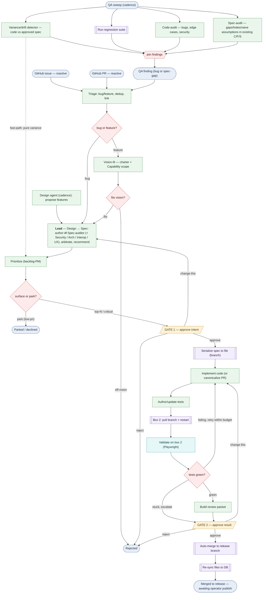

# Evolve — SDLC process flow (v0.4.0)

> **Generated view.** The source of truth is [`sdlc.yaml`](./sdlc.yaml); this
> Mermaid is the picture of it. Open this file in GitHub (or VS Code preview /
> mermaid.live) to see the graph. See [`../EVOLVE.md`](../EVOLVE.md) for the design.

**Legend:** 🟦 event (incl. cadence triggers) · 🟩 agent (one specialized agent
each) · 🟪 system (deterministic automation, no LLM) · 🟨 human gate · 🟥 gateway
(branch/join). Dashed edge = the variance fast-path.

### Reading it

- **Four intake lanes — two reactive, two proactive:**
  - **Reactive:** *GitHub issues* and *PRs* (one connector, no in-app tracker) → **Triage**.
  - **Proactive A — Design agent (cadence):** generates new-feature proposals from
    the charter + request clusters + C/F/S coverage gaps → enters at the **Lead**
    (already vision-aligned).
  - **Proactive B — QA / bug-discovery (cadence):** a *separate* system running four
    detectors in parallel — **variance/drift** (code vs. approved spec), the
    **regression suite**, a **code-audit** agent (defects in the *code*), and a
    **spec-audit** agent (gaps/holes/naive assumptions in the *C/F/S* itself) —
    whose findings become **bug or spec-gap** work items → **Triage**.
- **Variance fast-path** (dashed): a *pure* code-vs-approved-spec drift skips
  Spec-author **and** Gate 1 (the intent was approved when the spec was) → straight
  to **Prioritize**, then implement → validate → Gate 2.
- **Vision-fit** judges against the **platform charter + the target Capability's
  scope** (help.md/guide.md are inputs, not the authority).
- **Prioritize** is the attention valve: long tail *parked/declined* (recorded);
  only **top-N or safety-critical** continue.
- **The Lead owns the spec phase** (an agentic inner loop inside the deterministic
  walk). It runs **Design** (how should it work — reframes the ask, sets the approach,
  honors the engineering principles), then iterates **Spec-author ⇄ Spec-auditor** in
  **bounded** rounds (a stuck negotiation *escalates* to the human rather than spinning),
  brings in **Security / Architecture / Interop / UX**, **arbitrates**, and is the single
  agent that hands the human a synthesized **proposal + recommendation** at Gate 1. Every
  agent (the Lead included) emits a plain-language `summary` and gets its own UI panel.
- **Gate 1** (approve intent) → autonomous **implement + author tests** on the box-1
  branch → **box 2** validates with Playwright → loop **failing→retry** / **stuck→
  escalate** / **green→packet** → **Gate 2** → **auto-merge to the `release` branch**
  → **re-sync**. Both gates can **bounce back** ("change this").
- **The build half fails closed (#29).** A change reaches a *green* Gate 2 only when the
  implement agent actually changed code **and** included a runnable **bound test**, and
  box 2 ran *that* test (not the engine's own suite) and it passed. A failed/empty/untested
  implement, or red bound tests, never green — it lands at Gate 2 with a `change`
  recommendation that names the reason, so a broken build can't be auto-approved.
- **The per-change process ends at `release`, not `main`.** Promotion `release →
  main` (publish to the world) is a separate, operator-owned **release gate** —
  batched over many completed instances and canaried on the Pi — so it lives outside
  this per-change graph (EVOLVE.md §5/§9).
