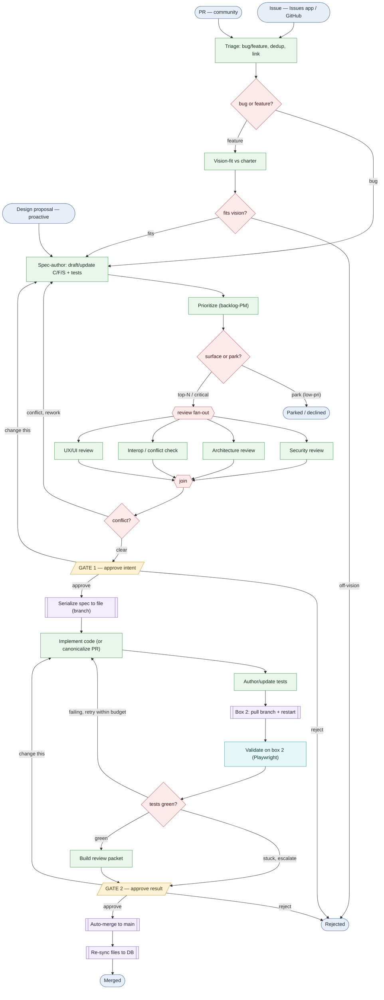

# Evolve — SDLC process flow (v0.1)

> **Generated view.** The source of truth is [`sdlc.yaml`](./sdlc.yaml); this
> Mermaid is the picture of it. Open this file in GitHub (or VS Code preview /
> mermaid.live) to see the graph. See [`../EVOLVE.md`](../EVOLVE.md) for the design.

**Legend:** 🟦 event · 🟩 agent (one specialized agent each) · 🟪 system
(deterministic automation, no LLM) · 🟨 human gate · 🟥 gateway (branch/join).

### Reading it

- **Three intake sources** (top) converge at **Spec-author** — issues/PRs go
  through Triage first (and features through Vision-fit); proactive Design
  proposals are already vision-aligned, so they enter at Spec-author.
- **Prioritize** is the attention valve: the long tail is *parked/declined*
  (recorded, never lost); only the **top-N or safety-critical** continue.
- **Review fan-out** runs Security / Architecture / Interop / UX in parallel, then
  joins; an **interop conflict** routes back to Spec-author for rework.
- **Gate 1** (approve intent) → autonomous **implement + author tests** on the
  box-1 workspace branch → **box 2** pulls + validates with Playwright.
- The tests gateway loops **failing → retry** (within budget) or **stuck →
  escalate**; **green** builds the review packet.
- **Gate 2** (approve the packet) → **auto-merge** spec+code+tests → **re-sync**.
- Both gates can **bounce back** ("change this") instead of approve/reject.
